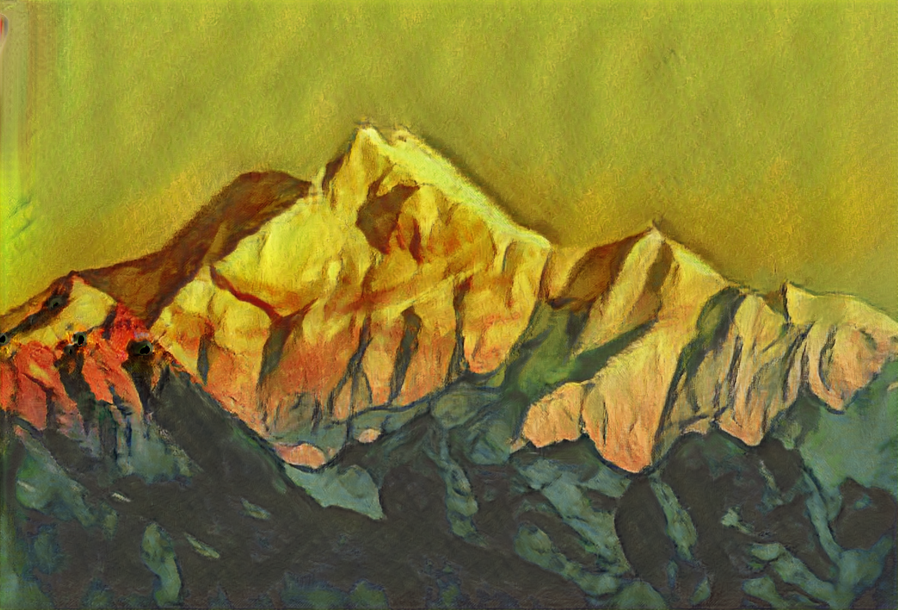

# ASMA-GAN
## Anisotropic Stroke Control for Multiple Artists Style Transfer
## Proceedings of the 28th ACM International Conference on Multimedia
**The official repository with Pytorch**

[[Arxiv paper]](https://arxiv.org/abs/2010.08175)

## Methodology


## Dependencies
- python3.6+
- pytorch1.5+
- torchvision
- pyyaml 
- paramiko 
- pandas 
- requests 
- tensorboard 
- tensorboardX 
- tqdm

## Installation
### We highly recommend you to use Anaconda for installation
```
conda create -n ASMA python=3.6
conda activate ASMA
conda install pytorch==1.5.0 torchvision==0.6.0 cudatoolkit=10.1 -c pytorch
pip install pyyaml paramiko pandas requests tensorboard tensorboardX tqdm
```

## Preparation
- **Traning dataset**
    - Coming soon
- **pre-trained model**
    - Download the model from [Github Releases](https://github.com/neuralchen/ASMAGAN/releases/download/v.1.0/ASMfinal.zip), and unzip the files to ***./train_logs/***
    

## Usage
### To test with pretrained model
The command line below will generate 1088*1920 HD style migration pictures of 11 painters for each picture of testImgRoot (11 painters include: Berthe Moriso , Edvard Munch, Ernst Ludwig Kirchner, Jackson Pollock, Wassily Kandinsky, Oscar-Claude Monet, Nicholas Roerich, Paul Cézanne, Pablo Picasso ,Samuel Colman, Vincent Willem van Gogh
- Example of style transfer with  ***all 11*** artists style 
    ```console
    python main.py --mode test --cuda 0 --version ASMfinal  --dataloader_workers 8   --testImgRoot ./bench/ --nodeName localhost --checkpoint 350000 --testScriptsName common_useage --specify_sytle -1 
    ```

- Example of style transfer with  ***Pablo Picasso*** style 

    ```console
    python main.py --mode test --cuda 0 --version ASMfinal  --dataloader_workers 8   --testImgRoot ./bench/ --nodeName localhost --checkpoint 350000 --testScriptsName common_useage --specify_sytle 8 
    ```

- Example of style transfer with  ***Wassily Kandinsky*** style 

    ```console
    python main.py --mode test --cuda 0 --version ASMfinal  --dataloader_workers 8   --testImgRoot ./bench/ --nodeName localhost --checkpoint 350000 --testScriptsName common_useage --specify_sytle 4
    ```

--version refers to the ASMAGAN training logs name.

--testImgRoot can be a folder with images or the path of a single picture.You can assign the image(s) you want to perform style transfer to this argument.

--specify_sytle is used to specify which painter's style is used for style transfer. When the value is -1, 11 painters' styles are used for image(s) respectively for style transfer. The values corresponding to each painter's style are as follows
[0: Berthe Moriso, 1: Edvard Munch, 2: Ernst Ludwig Kirchner, 3: Jackson Pollock, 4: Wassily Kandinsky, 5: Oscar-Claude Monet, 6: Nicholas Roerich, 7: Paul Cézanne, 8: Pablo Picasso, 9 : Samuel Colman, 10: Vincent Willem van Gogh]

### Training
Coming soon

## To cite our paper
```
@inproceedings{DBLP:conf/mm/ChenYLQN20,
  author    = {Xuanhong Chen and
               Xirui Yan and
               Naiyuan Liu and
               Ting Qiu and
               Bingbing Ni},
  title     = {Anisotropic Stroke Control for Multiple Artists Style Transfer},
  booktitle = {{MM} '20: The 28th {ACM} International Conference on Multimedia, 2020},
  publisher = {{ACM}},
  year      = {2020},
  url       = {https://doi.org/10.1145/3394171.3413770},
  doi       = {10.1145/3394171.3413770},
  timestamp = {Thu, 15 Oct 2020 16:32:08 +0200},
  biburl    = {https://dblp.org/rec/conf/mm/ChenYLQN20.bib},
  bibsource = {dblp computer science bibliography, https://dblp.org}
}
```

## Some Results


## Related Projects
Learn about our other projects [[RainNet]](https://neuralchen.github.io/RainNet), [[Sketch Generation]](https://github.com/TZYSJTU/Sketch-Generation-with-Drawing-Process-Guided-by-Vector-Flow-and-Grayscale), [[CooGAN]](https://github.com/neuralchen/CooGAN), [[Knowledge Style Transfer]](https://github.com/AceSix/Knowledge_Transfer), [[SimSwap]](https://github.com/neuralchen/SimSwap),[[ASMA-GAN]](https://github.com/neuralchen/ASMAGAN),[[Pretrained_VGG19]](https://github.com/neuralchen/Pretrained_VGG19).

## High Resolution Results





